# Avoiding Frontend Framework Lock-in with HAWC and wc-bindable-protocol

## Overview

HAWC (Headless Async Web Components) is an architectural concept that leverages Web Components as headless, asynchronous components, separating async processing from the framework layer. Built on wc-bindable-protocol as its foundation, it enables reuse across any framework through thin adapters.

This document summarizes the technical structure of HAWC, its contribution to solving the framework lock-in problem, and its practical operational benefits.

## Background: The Nature of Framework Lock-in

Framework lock-in in frontend development is often framed as a UI component compatibility problem. However, the true source of migration cost lies in business logic — specifically, asynchronous processing.

`fetch` calls, WebSocket connections, polling, loading state management — these are all written tightly coupled to framework-specific lifecycle APIs: React's `useEffect`, Vue's `onMounted`, Svelte's `onMount`, and so on. When migrating frameworks, rewriting templates can be done mechanically, but re-implementing async logic requires semantic understanding of the code. This is where the real bottleneck lies.

## HAWC's Architecture

HAWC structurally resolves this problem by moving the location of async processing from the framework side into the Web Component side.

### Three-Layer Structure

HAWC's architecture consists of three layers:

**Headless Web Component Layer** — Encapsulates async processing (HTTP communication, WebSockets, timers, etc.) internally and autonomously manages state (`value`, `loading`, `error`, `status`, etc.). It has no UI whatsoever and functions as a pure service layer.

**Protocol Layer (wc-bindable-protocol)** — Components declare their bindable properties via a `static wcBindable` field and notify state changes via `CustomEvent`. Adapters simply read this declaration and subscribe to the events.

**Framework Layer** — Connects to the protocol through a thin adapter and renders the received state. Contains absolutely no async processing code.



### Conversion to a State Machine Subscription

The core insight of this architecture is that async processing is converted into a subscription to a state machine. From the framework's perspective, properties like `values.loading` and `values.error` exposed by a component such as `<my-fetch>` are simply reactive values — there is no need to be aware that async processing is happening at all. Whether written in React or Vue, the code structure becomes nearly identical.

```tsx
// React — no fetch(), no async/await, no loading state management needed
const [ref, values] = useWcBindable<MyFetchElement, MyFetchValues>();
// values.loading, values.value, values.error — all reactive
```

```vue
<!-- Vue — same component, same structure -->
<script setup>
const { ref, values } = useWcBindable({ value: null, loading: false });
</script>
<template>
  <my-fetch :ref="ref" url="/api/data" />
  <p v-if="values.loading">Loading...</p>
  <p v-else>{{ values.value }}</p>
</template>
```

## Design of wc-bindable-protocol

### Minimal Convention

The protocol declaration is extremely small:

```javascript
class MyFetch extends HTMLElement {
  static wcBindable = {
    protocol: "wc-bindable",
    version: 1,
    properties: [
      { name: "value",   event: "my-fetch:value-changed" },
      { name: "loading", event: "my-fetch:loading-changed" },
      { name: "error",   event: "my-fetch:error-changed" },
      { name: "status",  event: "my-fetch:status-changed" },
    ],
  };
}
```

Each property descriptor requires only two fields: `name` (property name) and `event` (CustomEvent name). An optional `getter` function can customize how the event payload is extracted. Nothing more, nothing less.

### Zero Dependencies — Web Standards Only

The protocol uses only two browser-native APIs: `static` class fields and `CustomEvent`. No build tools, no polyfills, no runtime libraries. Both are stable, long-standing Web standards, and a future in which `CustomEvent` is deprecated is difficult to imagine. This characteristic provides a strong answer to the question: "Will this still work in 10 years?"

### Deliberate Scope Limitations

The protocol intentionally excludes the following from its scope:

- Two-way binding (one-way only: component to framework)
- Form integration
- SSR / hydration
- Validation and schema enforcement

The moment the scope is expanded, complexity explodes. These limitations reflect sound design judgment.

## The Thinness of the Adapter

The core `bind()` function can be implemented in roughly 10 lines:

```javascript
const DEFAULT_GETTER = (e) => e.detail;

function bind(element, onUpdate) {
  const { protocol, version, properties } = element.constructor.wcBindable;
  if (protocol !== "wc-bindable" || version !== 1) return;

  for (const prop of properties) {
    const getter = prop.getter ?? DEFAULT_GETTER;
    element.addEventListener(prop.event, (event) => {
      onUpdate(prop.name, getter(event));
    });
    const current = element[prop.name];
    if (current !== undefined) {
      onUpdate(prop.name, current);
    }
  }
}
```

Framework-specific adapters are also just a few dozen lines each. React's `useWcBindable`, Vue's `useWcBindable`, and Svelte's `use:wcBindable` are all thin wrappers around this core function.

## Effectiveness as a Framework Lock-in Escape

### Commoditization of Frameworks

Once async processing is externalized into Web Components, the framework layer becomes a pure rendering machine. As a result, the criteria for choosing a framework shift. Rather than evaluating how well a framework handles business logic or async processing, teams can choose based on superficial factors: template syntax preference, rendering performance, developer experience. This is the commoditization of frameworks.

### Freedom from "Irreversible Decisions"

Framework selection has traditionally been a weighty, long-term decision. With HAWC, migrating frameworks means rewriting only templates and bindings — the business logic layer remains intact. Framework selection becomes a choice that can be revisited at any time, dramatically reducing the organizational cost of decision-making.

### Retaining the Benefits of Frameworks

Most framework lock-in escape strategies ultimately reduce to either "don't use a framework" or "add another abstraction layer," each of which creates its own new form of lock-in. HAWC takes the opposite approach: it assumes continued framework use and simply externalizes only the non-portable parts. Declarative UI, reactive rendering, and framework-specific ecosystems can all be enjoyed as-is.

## Practical Operational Benefits

### Incremental Adoption

There is no need for a full upfront migration of existing applications. Teams can start by writing only new API calls as headless Web Components and gradually move async processing outside the framework. Thanks to the spec's initial value sync behavior, calling `bind()` partway through correctly picks up existing state, so coexistence with legacy code is not a problem.

### Virtually Eliminated OSS Dependency Risk

Because the total codebase across all packages is extremely small, the typical OSS dependency risk — "what if the community stops maintaining it?" — is nearly nonexistent. It can be forked, read, fixed, and maintained. At the extreme, running an internal company fork is entirely manageable given the codebase's size.

Teams do not need to wait for the ecosystem to reach critical mass (an abundance of protocol-compatible components) for the migration motivation to be compelling for their own service. The smallness of the protocol itself dramatically lowers the barrier to adoption.

### The Headless Insight

By treating Web Components not as "visible UI parts" but as an "async service layer," the styling problems associated with Shadow DOM — historically one of the biggest barriers to Web Component adoption — are sidestepped entirely. Headless components have no DOM and no styles, so the Shadow DOM boundary simply never becomes an issue.

## Conclusion

What HAWC and wc-bindable-protocol provide is not a replacement for frameworks, but a structure that is free from framework dependency.

A zero-dependency protocol design relying solely on Web standards, adapters that fit in a few dozen lines, and async processing encapsulated in headless Web Components — together, these form a practical and durable escape from frontend framework lock-in.

## Reference

- wc-bindable-protocol: https://github.com/wc-bindable-protocol/wc-bindable-protocol